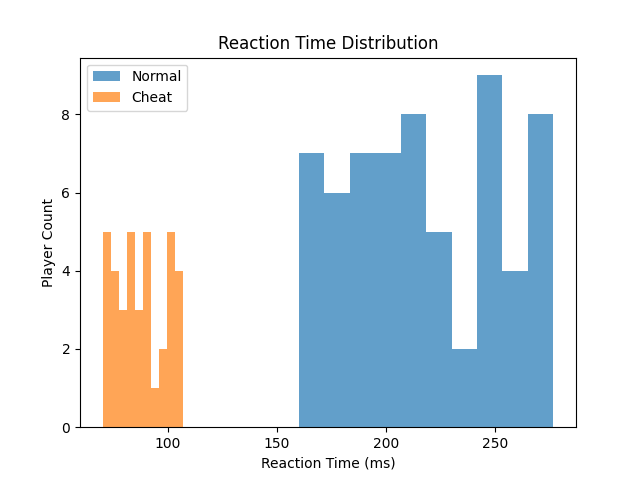

# 🎯 Valorant AI Anti-Cheat Behavior Detector
> AI-powered anti-cheat behavior analysis system for FPS telemetry data


---

## 📌 Overview
FPS 게임 플레이 로그를 기반으로 핵 사용자를 탐지하는 **AI 행동 분석 시스템**입니다.

다음 데이터를 기반으로 핵 의심 여부를 판별합니다.

- 반응속도
- 에임 스냅
- 클릭 간격 분산
- 반동 제어 편차

---

## 🚀 Features
- ⚡ FastAPI 기반 실시간 API
- 📁 CSV 플레이 로그 자동 생성
- 📈 반응속도 분포 그래프
- 📊 핵 비율 리포트 API
- 🤖 RandomForest 머신러닝 학습
- 🎯 실시간 핵 예측 API

---

## 📷 Preview


---

## 🧠 AI Prediction Example
```json
{
  "prediction": "cheat",
  "message": "핵 의심"
}
```

---

## 🛠️ API Endpoints
- `POST /detect`
- `GET /report`
- `POST /predict`

---

## 🔥 Future Roadmap
- React 대시보드
- WebSocket 실시간 분석
- 플레이어별 위험도 추적
- 딥러닝 기반 에임 패턴 분석
- 실시간 경기 리플레이 분석
